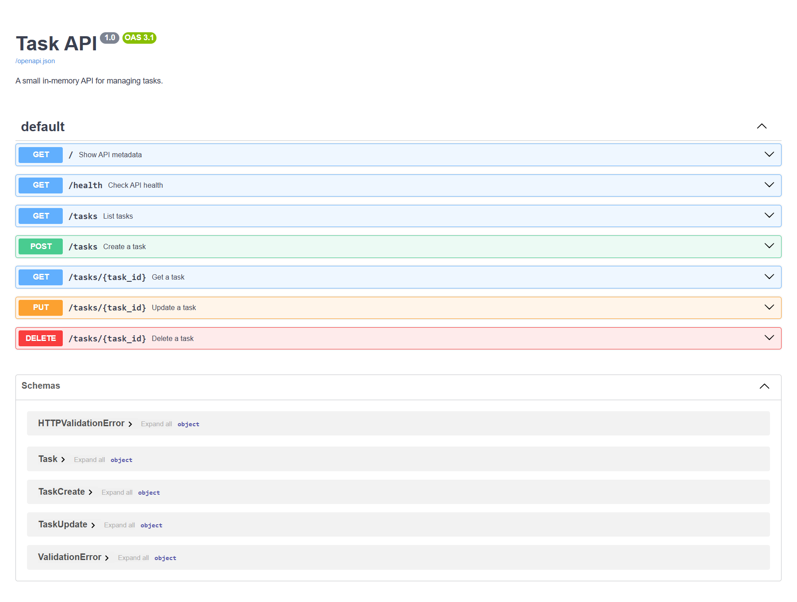
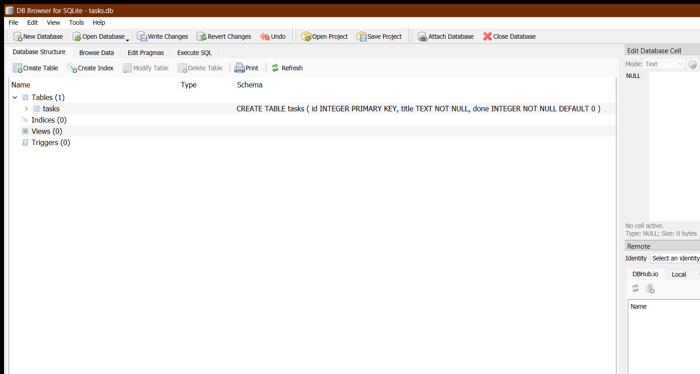

# Task API


Task API is a small FastAPI project demonstrating create, read, update, and
delete operations against a persistent to-do list. SQLite was chosen because it
provides durable local storage without a separate database server or additional
Python dependency.

## Install and run

Python 3.10 or newer is required.

```bash
python -m venv .venv
python -m pip install -r requirements.txt
python -m uvicorn app.main:app --reload
```

Open Swagger UI at <http://127.0.0.1:8000/docs>.

On the first start, the app automatically creates `tasks.db` in the repository
root, creates the `tasks` table, and inserts the three example tasks only when
the table is empty. No manual database setup is required on a clean clone.
Creates, updates, and deletes remain in `tasks.db` across server restarts. The
runtime database file is intentionally ignored by Git.

Run the automated checks with:

```bash
python -m pytest -q
```

## Endpoints

| Method | Path | Purpose | Success |
|---|---|---|---|
| GET | `/` | Show API metadata | 200 |
| GET | `/health` | Check API health | 200 |
| GET | `/tasks` | List tasks | 200 |
| GET | `/tasks/{task_id}` | Get one task | 200 |
| POST | `/tasks` | Create a task | 201 |
| PUT | `/tasks/{task_id}` | Update a task | 200 |
| DELETE | `/tasks/{task_id}` | Delete a task | 204 |

Unknown task IDs return `404`. Invalid POST or PUT request bodies return `400`.

## Example response

Real output from `curl -i http://127.0.0.1:8000/health`:

```http
HTTP/1.1 200 OK
date: Tue, 11 Aug 2026 19:49:16 GMT
server: uvicorn
content-length: 15
content-type: application/json

{"status":"ok"}
```

## Swagger UI



## SQLite exploration



In DB Browser for SQLite, this query returned `3`, confirming the database held
the three initial example tasks before the Stage 4 update and delete exercise:

```sql
SELECT COUNT(*) FROM tasks;
```
