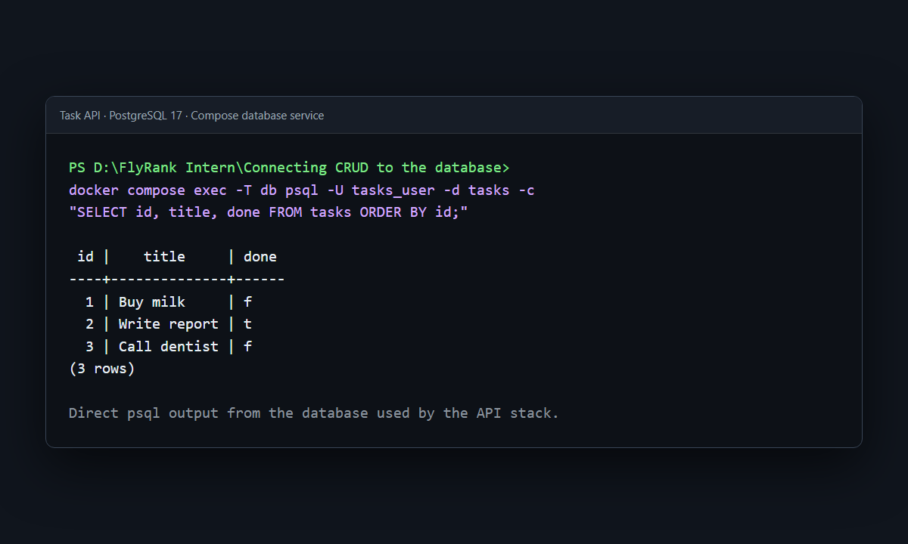

# LLM Support Triage API

This FastAPI endpoint turns one unstructured support message into a validated category, urgency, team, confidence, and one-sentence reason. Model text is treated as untrusted: the service validates it, repairs it once when necessary, and never exposes raw completions.

## Run it and call `/triage`

From a fresh clone, copy the environment template, fill `SUPABASE_URL`, `SUPABASE_KEY`, and `LLM_API_KEY` in the ignored `.env`, then start the existing API and database:

```powershell
Copy-Item .env.example .env
docker compose up --build -d
```

Make a real-model request:

```powershell
curl.exe -s -X POST http://127.0.0.1:8000/triage -H "Content-Type: application/json" -d '{"text":"I was charged twice for my monthly plan."}'
```

Exact response from a real `google/gemma-4-26b-a4b-it:free` call:

```json
{"category":"billing","urgency":"normal","suggested_team":"billing","confidence":1.0,"reason":"The user is reporting a duplicate charge for their subscription."}
```

An empty input returns HTTP 400 and identifies `text` before any model call:

```powershell
curl.exe -i -X POST http://127.0.0.1:8000/triage -H "Content-Type: application/json" -d '{"text":""}'
```

## Job card

The concise product/problem, user, provider, success, safety, and scope decisions are in [`JOB-CARD.md`](JOB-CARD.md). The endpoint is deliberately one-shot triage—not chat, memory, RAG, an agent, or a decision-maker for high-impact actions.

## Provider, model, and three swap settings

The implementation uses OpenRouter's OpenAI-compatible API and `google/gemma-4-26b-a4b-it:free`. Swap providers or models without code changes by setting exactly these three connection variables:

```dotenv
LLM_BASE_URL=https://openrouter.ai/api/v1
LLM_API_KEY=your_openrouter_key
LLM_MODEL=google/gemma-4-26b-a4b-it:free
```

Operational controls are `LLM_ENABLED=false` for an immediate zero-call 503 and `LLM_STUB=1` for deterministic zero-call development output. The real key belongs only in `.env`; never commit it or send confidential/personal data to a free provider.

## Real eval score

On 2026-08-13, prompt `triage-v1` scored **100.0% (24/24 key-field checks)** across exactly eight labelled billing, bug, feature, generic, outage, ambiguous, prompt-injection, and empty-ish cases. There were no failed case IDs.

```powershell
.\.venv\Scripts\python.exe evals\run_evals.py
```

## One-call cost log

One successful real eval call emitted this stdout line:

```json
{"prompt_version":"triage-v1","model":"google/gemma-4-26b-a4b-it:free","input_tokens":550,"output_tokens":38,"duration_ms":2327,"repair_count":0}
```

## 10,000 requests/day estimate

At the observed 588 tokens per successful request, 10,000 requests are approximately **5.88 million tokens/day**. The selected `:free` route has an estimated provider charge of **$0/day**, but its shared rate limits make it unsuitable for guaranteed 10,000-request daily throughput; any paid replacement should recalculate cost from its current input/output token prices.

## What I would fix with another day

I would add an explicitly approved fallback model and measure it against the same eight cases, because shared free-provider rate limits—not schema reliability—were the main observed operational weakness.

---

## Existing repository projects

| Project | Purpose | Main technologies | Entry point |
|---|---|---|---|
| **Task API + LLM triage** | Persistent CRUD API, hosted authentication, and validated support routing | FastAPI, PostgreSQL, Supabase Auth, OpenRouter, Docker Compose | `docker compose up --build` |
| **The Polite Scraper** | Collect and validate exactly 60 books from a public practice sandbox | Requests, Beautiful Soup, Pydantic, JSON cache | `python -m src.main` from `scraper/` |

The projects share a repository but are operationally independent. The root
application is the Task API; the scraper and its own dependencies, tests, and
documentation live under [`scraper/`](scraper/README.md).

---

# 1. Task API

The Task API is a FastAPI service backed by PostgreSQL. It exposes persistent
task CRUD operations, email/password signup and login through Supabase Auth,
reusable Bearer-token verification, public and protected example routes, and
interactive OpenAPI documentation.


## Architecture

```text
Client
  │
  ├── task requests ───────────────▶ FastAPI routes
  │                                      │
  │                                      ▼
  │                              repository.py
  │                                      │
  │                                      ▼
  │                                  PostgreSQL
  │
  └── signup / login / Bearer JWT ──▶ Supabase Auth
                                         │
                                         └── verified user dependency
                                                │
                                                ▼
                                        protected routes
```

- `app/main.py` defines request models, HTTP routes, status codes, and stable
  JSON errors.
- `app/repository.py` owns all PostgreSQL access and uses parameterized SQL.
- `app/auth.py` configures the Supabase client and the reusable HTTP Bearer
  dependency.
- Supabase owns passwords, user accounts, sessions, and JWT issuance. The API
  never stores passwords or signs tokens itself.

## API quick start

### Prerequisites

- Docker Desktop or another Docker Engine with Compose
- A Supabase project with email/password authentication enabled
- A Supabase publishable key or legacy `anon` key—never a `service_role` key

Copy the environment template:

```bash
cp .env.example .env
```

On PowerShell:

```powershell
Copy-Item .env.example .env
```

Update only the Supabase placeholders in the ignored `.env` file:

```dotenv
SUPABASE_URL=https://your-project.supabase.co
SUPABASE_KEY=your_anon_or_publishable_key
```

The included PostgreSQL development values work with Compose. Start both
services from the repository root:

```bash
docker compose up --build
```

Open:

- Swagger UI: <http://127.0.0.1:8000/docs>
- Health check: <http://127.0.0.1:8000/health>

The API waits briefly for PostgreSQL, creates the `tasks` table when necessary,
and inserts three sample tasks only when the table is empty.

## Environment variables

| Variable | Used by | Purpose |
|---|---|---|
| `POSTGRES_USER` | PostgreSQL / Compose | Database login |
| `POSTGRES_PASSWORD` | PostgreSQL / Compose | Local development password |
| `POSTGRES_DB` | PostgreSQL / Compose | Database name |
| `DATABASE_URL` | FastAPI | Psycopg connection string; Compose uses host `db` |
| `SUPABASE_URL` | FastAPI | Hosted Supabase project URL |
| `SUPABASE_KEY` | FastAPI | Publishable or legacy `anon` key |
| `LLM_BASE_URL` | FastAPI | OpenAI-compatible provider base URL |
| `LLM_API_KEY` | FastAPI | Provider key; keep only in ignored `.env` |
| `LLM_MODEL` | FastAPI | Provider model identifier |
| `LLM_ENABLED` | FastAPI | `false` disables all LLM calls with HTTP 503 |
| `LLM_STUB` | FastAPI | `1` returns deterministic output with zero calls |

`.env` is excluded from Git. `.env.example` contains only development defaults
and placeholders.

## Endpoint reference

### General and task routes

| Method | Path | Authentication | Purpose | Success |
|---|---|---|---|---:|
| `GET` | `/` | Public | API metadata | 200 |
| `GET` | `/health` | Public | Health check | 200 |
| `GET` | `/tasks` | Public | List all tasks | 200 |
| `GET` | `/tasks/{task_id}` | Public | Read one task | 200 |
| `POST` | `/tasks` | Public | Create a task | 201 |
| `PUT` | `/tasks/{task_id}` | Public | Update title and/or completion | 200 |
| `DELETE` | `/tasks/{task_id}` | Public | Delete a task | 204 |

### Authentication and protected routes

| Method | Path | Authentication | Purpose | Success |
|---|---|---|---|---:|
| `POST` | `/auth/signup` | Public | Create a Supabase user | 201 |
| `POST` | `/auth/login` | Public | Return access and refresh tokens | 200 |
| `POST` | `/auth/logout` | Bearer token | Sign out the verified user | 204 |
| `GET` | `/public/info` | Public | Public example resource | 200 |
| `GET` | `/protected/profile` | Bearer token | Return safe verified-user fields | 200 |
| `GET` | `/protected/dashboard` | Bearer token | Protected example resource | 200 |

Invalid request bodies return JSON `400` responses. Unknown task IDs return
JSON `404`. Missing, malformed, invalid, tampered, or expired Bearer tokens
return JSON `401` with `WWW-Authenticate: Bearer`.

## Authentication flow

Supabase Auth uses JWTs for authentication. The backend verifies each presented
access token with `supabase.auth.get_user(token)` before a protected handler is
allowed to run; it does not trust unverified client session data.

1. Sign up with an email and password:

   ```bash
   curl -X POST http://127.0.0.1:8000/auth/signup \
     -H "Content-Type: application/json" \
     -d '{"email":"person@example.com","password":"strong-password"}'
   ```

2. If **Confirm email** is enabled in the Supabase project, confirm the email
   before logging in. Hosted projects enable confirmation by default; the
   setting can be changed in the Supabase Auth provider configuration.

3. Log in:

   ```bash
   curl -X POST http://127.0.0.1:8000/auth/login \
     -H "Content-Type: application/json" \
     -d '{"email":"person@example.com","password":"strong-password"}'
   ```

4. Send the returned access token to a protected endpoint:

   ```bash
   curl http://127.0.0.1:8000/protected/profile \
     -H "Authorization: Bearer <access_token>"
   ```

In Swagger UI, select **Authorize** and paste only the access token into the
HTTP Bearer field.

## Task examples

Create a task:

```bash
curl -X POST http://127.0.0.1:8000/tasks \
  -H "Content-Type: application/json" \
  -d '{"title":"Ship the API"}'
```

Update it:

```bash
curl -X PUT http://127.0.0.1:8000/tasks/4 \
  -H "Content-Type: application/json" \
  -d '{"done":true}'
```

Delete it:

```bash
curl -i -X DELETE http://127.0.0.1:8000/tasks/4
```

## Database schema and persistence

The API initializes this minimal schema:

```sql
CREATE TABLE IF NOT EXISTS tasks (
    id SERIAL PRIMARY KEY,
    title TEXT NOT NULL,
    done BOOLEAN NOT NULL DEFAULT FALSE
);
```

All request-derived values are passed separately to Psycopg `%s` placeholders.
SQL is kept out of route handlers.

Inspect the same rows directly inside the database container:

```bash
docker compose exec db psql -U tasks_user -d tasks \
  -c "SELECT id, title, done FROM tasks ORDER BY id;"
```



PostgreSQL data lives in the Compose named volume `taskdata` and survives:

```bash
docker compose down
docker compose up
```

Use `docker compose down -v` only when you intentionally want to remove the
database volume and its contents.

## API tests

The root test suite covers CRUD behavior, PostgreSQL persistence, request
validation, authentication responses, Bearer-token edge cases, protected-route
reuse, logout, and OpenAPI security metadata.

With PostgreSQL available and all required environment variables configured:

```bash
python -m pytest tests -q
```

---

# 2. The Polite Scraper

The scraper processes exactly the first three catalogue pages of
[Books to Scrape](https://books.toscrape.com/) and the 60 unique book-detail
pages discovered from them. It does not hardcode product URLs.

## Verified scraper result

| Checkpoint | Result |
|---|---:|
| Catalogue pages followed | 3 |
| Unique product URLs discovered | 60 |
| Valid records written | 60 |
| Invalid records | 0 |
| Failed pages | 0 |
| Cache hits on verified rerun | 63 |
| Deterministic tests | 32 passing |

## Scraper pipeline

```text
classify target
      ↓
fetch politely → cache HTML
      ↓
follow 3 catalogue pages
      ↓
discover + deduplicate 60 URLs
      ↓
extract → normalize → validate
      ↓
books.json / errors.json
      ↓
run-report.json
```

## Scraper quick start

From the repository root on Windows:

```powershell
cd scraper
python -m venv .venv
.\.venv\Scripts\python.exe -m pip install -r requirements.txt
.\.venv\Scripts\python.exe -m src.main
```

On macOS or Linux, use `.venv/bin/python` instead of the Windows interpreter
path. A successful run ends with:

```text
catalogue_pages=3 discovered=60 unique_urls=60 valid_records=60 invalid_records=0 failed_pages=0
```

## Scraper outputs

| File | Purpose |
|---|---|
| `scraper/output/books.json` | Validated records only; expected count is 60 |
| `scraper/output/errors.json` | Rejected candidates and validation reasons |
| `scraper/output/run-report.json` | Timing, cache, record, and failure counters |

Generated outputs and cached HTML remain local and are ignored by Git. A
[representative cached-run report](scraper/output/sample-run-report.json) is
committed.

Each valid record contains:

```json
{
  "title": "A Light in the Attic",
  "product_url": "https://books.toscrape.com/catalogue/a-light-in-the-attic_1000/index.html",
  "price_text": "£51.77",
  "price_gbp": 51.77,
  "availability_text": "In stock (22 available)",
  "rating_text": "Three",
  "description": "A collection of poems...",
  "source_page": "https://books.toscrape.com/",
  "fetched_at": "2026-08-13T14:19:17.260374Z"
}
```

`product_url` is the canonical identity. `description` may be `null`; the raw
price and provenance fields remain alongside normalized `price_gbp`.

## Politeness and failure behavior

- Sends an identifiable `ThePoliteScraper` User-Agent.
- Uses a 15-second timeout and waits at least 0.5 seconds before every real
  request.
- Parses only HTTP 200 responses and caches successful HTML as UTF-8.
- Retries timeouts and 5xx responses once; never retries 403 or 404.
- Never refetches an existing cached page unnecessarily.
- Isolates each detail page so a single failure cannot stop later books.
- Rebuilds output files and deduplicates by canonical `product_url` on every
  run.

Run its deterministic tests from `scraper/`:

```powershell
.\.venv\Scripts\python.exe -m pytest -q --basetemp=.tmp\pytest
```

For the complete target classification, schema, retry policy, limitations, and
ethics notes, see the dedicated [scraper README](scraper/README.md).

---

# Repository structure

```text
.
├── app/
│   ├── main.py                 # Task API routes and request models
│   ├── auth.py                 # Supabase client and Bearer verification
│   └── repository.py           # PostgreSQL persistence
├── scraper/
│   ├── src/                    # Scraper pipeline implementation
│   ├── tests/                  # Deterministic scraper tests
│   ├── output/                 # Ignored runtime output + sample report
│   ├── requirements.txt
│   └── README.md
├── tests/                      # Task API, database, and auth tests
├── docs/                       # SQL checks and verification screenshots
├── compose.yaml                # API + PostgreSQL services
├── Dockerfile                  # Task API image
├── requirements.txt            # Task API dependencies
├── .env.example                # Safe environment template
├── PRODUCT.md                  # Scraper requirements
├── ARCHITECTURE.md             # Scraper design
├── TASKS.md                    # Scraper implementation checklist
├── EVIDENCE.md                 # Verified acceptance evidence
└── BUILDLOG.md                 # Meaningful engineering decisions/errors
```

# Security and operational notes

- Never commit `.env`, access tokens, refresh tokens, database dumps, or real
  Supabase credentials.
- Use only a publishable/`anon` Supabase key in this application; never use a
  `service_role` key.
- Protected API routes return only safe user fields and verify every request
  independently.
- The task CRUD endpoints are intentionally public for this learning project;
  add ownership and authorization rules before adapting them for a multi-user
  production system.
- The scraper is intentionally limited to a public practice sandbox and does
  not bypass authentication or access controls.

# Limitations

- The Task API depends on an external Supabase project for live authentication.
- Compose uses development credentials from `.env`; use managed secrets and
  stronger operational controls outside local development.
- Task rows are not associated with Supabase user IDs, so CRUD operations are
  not tenant-isolated.
- Scraper selectors target the current Books to Scrape markup and may require
  updates after a site redesign.

# License

No license file is currently included. Unless a license is added, standard
copyright rules apply.
